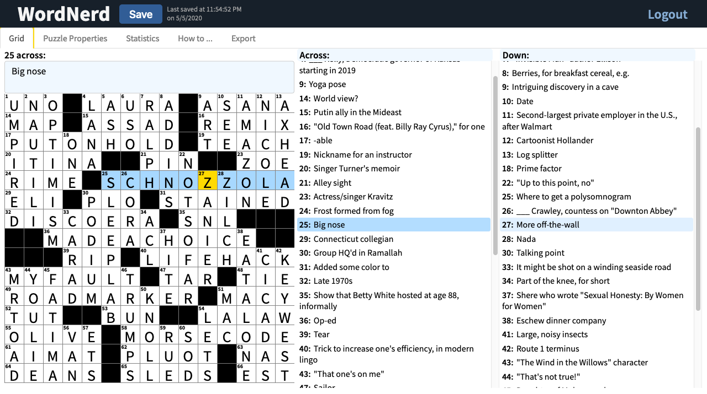

# NY Times style crossword editor
A tool to write NY Times style crosswords. [Deployed site](https://crossword-editor.herokuapp.com/)

## Features
With WordNerd, you can start from a blank rectangular grid, fill in the black squares, answers and corresponding clues, save drafts, and even export other formats.
The user's homepage lists their draft puzzles and completed puzzles.

Some of the highlights of the editor page are:

* As you add black squares (by typing a period), by default they will automatically fill in to make the grid rotationally symmetric, which is the convention in published puzzles (this can be switched to other types of symmetry or turned off at any time). 

* The numbered cells and corresponding slots for across and down clues update instantaneously.

* Rebus entries (cells that sneakily contain more than one character) can be added.  Circled cells are also common in crosswords, and these can also be easily toggled.

* Basic stats like word/letter counts are also updated in real time. 

* Puzzles can be exported to Across Lite format (a common native cross word solving application) to send to a friend to solve or print out.
Finally, the user can download a pdf that meets the format required to [submit to the New York Times](https://www.nytimes.com/puzzles/submissions/crossword "New York Times submission guidelines") 


## Local Setup
If you want to run the site locally, first clone this repo and change directories into it:

``` shell
git clone https://github.com/Crossword-Editor/crossword-editor.git
cd crossword-editor
```
We use `pipenv` to manage the Python virtual environment, which you can find information about at <https://pipenv.pypa.io/en/latest/>.
Once `pipenv` is installed, run `pipenv install` to set up the virtual environment.
If successful (the installation of `psycopg2` sometimes requires some troubleshooting), then run `pipenv shell` to activate the virtual environment.

Finally, copy the sample `.env` file:

``` shell
cp config/.env.sample config/.env
```


### Postgres Setup
The puzzle instances and user data are stored in a Postgres database.
Assuming Postgres is set up on your computer, the following sets up the 
database to match the [./config/.env.sample](./config/.env.sample).
```shell
createuser -d editor
createdb -U editor editor
```
If you prefer to replace 'editor' be another name for the user and database, make sure to update `.env` accordingly.

Since we're using a new database, we need to migrate:
```shell
python manage.py migrate
```
Hopefully, you see a lot of OK's.
Finally, try running the server to make sure everything is working:
``` shell
python manage.py runserver
```
If successful, you should see a message in the terminal informing you what localhost address to visit.

<!--  LocalWords:  WordNerd psycopg
 -->
